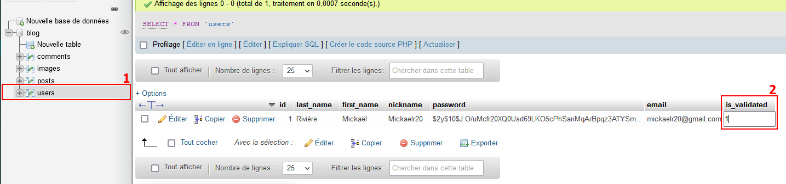

[![Codacy Badge][codacy-shield]][codacy-url]
[![LinkedIn][linkedin-shield]][linkedin-url]

<!-- PROJECT LOGO -->
<br />
<div align="center">
  <a href="https://github.com/Mickaelr20/the_blog">
    
  </a>

  <h3 align="center">The Blog</h3>

  <p align="center">
    Site web réalisé en PHP par Rivière Mickaël
  </p>
</div>

<!-- TABLE OF CONTENTS -->
<details>
  <summary>Sommaire</summary>
  <ol>
    <li><a href="#a-propos">À propos</a></li>
    <li><a href="#installation">Installation</a></li>
    <li><a href="#license">Licence</a></li>
    <li><a href="#contact">Contact</a></li>
  </ol>
</details>

<!-- A PROPOS -->

## A propos

[![Product Name Screen Shot][product-screenshot]](http://localhost:8000/)

Mon blog et portfolio sous forme de site web, réaliser en PHP, HTML 5 et CSS 3.

<!-- GETTING STARTED -->

## Installation

Pour installer le projet, vous aurez besoin d'un serveur web php et d'une base de données MySQL.

Copiez le projet à la racine de votre serveur web.

### Installer composer et ses dépendances :

Vous devez Installer composer sur votre machine.

Pour installer les dépendances composer, exécutez la commande suivante dans le répertoire du projet :
```sh
composer install
```

### Paramétrer la base de données :

Vous aurez besoin de créer les tables SQL utilisées par l'application, les tables sont :
"posts", "comments", "users" et "images".

Vous trouverez les scripts SQL pour créer les différentes tables à l'adresse suivante: https://github.com/Mickaelr20/the_blog/tree/main/scripts_sql

Accédez ensuite au fichier SqlConnection.php dans le répertoire: "chemin_du_projet/src/Model/" et changez les attributs "username" et "password" par le username et le password de votre utilisateur MySQL.

Accédez au fichier Table.php dans le répertoire: "chemin_du_projet/src/Model/Table/" et modifiez les attributs "host" et "dbName" pour y mettre l'URL vers votre serveur MySQL et le nom de la base à utiliser.

### Démarrage :

Lancez votre serveur web ou, dans le cadre ou vous installez le projet sur votre machine, exécutez la commande suivante pour lancer le projet avec le serveur web interne de PHP :
```sh
php -S localhost:8000
```

Le projet est maintenant installé et lancé, vous pouvez accéder à l'URL de votre page web ou "http://localhost:8000" si vous avez lancé le projet avec le serveur web interne de php.

Lorsque vous démarrez le projet pour la première fois, vous aurez besoin d'un compte validé pour accéder à la partie administration "/admin".

Pour créer votre premier utilisateur, veuillez vous rendre sur l'URL : "/signup" pour inscrire un premier utilisateur.
Vous devez ensuite accéder à la base de données, dans la base reliée à votre application, cliquez sur "users" et modifiez la valeur dans la colonne "is_validated" et mettre un "1". Voir schéma-ci - dessous :

<div align="center">
  <a target="_blank" href="img/readme_images/validation_premier_utilisateur.png">
    
  </a>
</div>

Vous pouvez maintenant vous connecter avec votre compte fraîchement créé et accéder à la partie administration.

## Dependences

Javascript:
<ul>
    <li>Trumbowygg (https://alex-d.github.io/Trumbowyg/)</li>
    <li>Jquery (https://jquery.com/)</li>
</ul>

Css:
<ul>
    <li>Bootstrap 5 (https://getbootstrap.com/docs/5.0/getting-started/introduction/)</li>
    <li>Line Awesome (https://icons8.com/line-awesome)</li>

</ul>
Thèmes utilisés:
<ul>
    <li>SB Admin: (https://startbootstrap.com/template/sb-admin)</li>
    <li>Agency: (https://startbootstrap.com/theme/agency)</li>
</ul>

<!-- LICENSE -->

## License

Distribué sous GNU GENERAL PUBLIC LICENSE V2. Voir https://github.com/Mickaelr20/the_blog/blob/main/LICENSE pour plus d'informations.

<!-- CONTACT -->

## Contact

Rivière Mickael - mickaelr20@gmail.com - [Mon LinkedIn][linkedin-url]

Lien du projet : [https://github.com/Mickaelr20/the_blog](https://github.com/Mickaelr20/the_blog/)

<!-- MARKDOWN LINKS & IMAGES -->
<!-- https://www.markdownguide.org/basic-syntax/#reference-style-links -->

[codacy-shield]: https://app.codacy.com/project/badge/Grade/2f75d23b061841fabdf2a2a8fa8d29f5
[codacy-url]: https://www.codacy.com/gh/Mickaelr20/the_blog/dashboard?utm_source=github.com&utm_medium=referral&utm_content=Mickaelr20/the_blog&utm_campaign=Badge_Grade
[linkedin-shield]: https://img.shields.io/badge/-LinkedIn-black.svg?logo=linkedin&colorB=555
[linkedin-url]: https://www.linkedin.com/in/mickael-riviere-s/
[product-screenshot]: img/readme_images/home_screenshot.png
